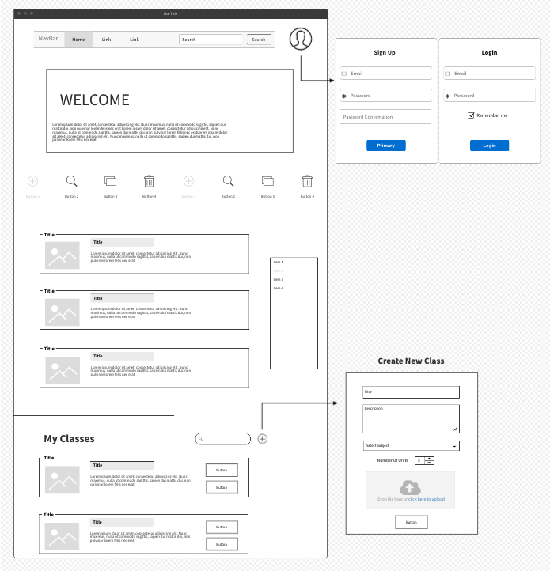

# Teachers Teach
Welcome to the platform that allows teachers to simply teach. here you can share materials with your colleagues and enrich your class.
---
## Description
All a good teacher wants, is to teach. To give over inspiring lessons, interesting classes. But those materials, don't just come from nowhere! they take hours of research and hard work to reach a complete lesson. just ONE lesson. by the end of the day, there is no more energy left to actually.... teach.
This is where we come in. Teachers Teach is a platform that will allow teachers to do what they really love, by sharing recourses, that will improve and enrich their lessons with a click.
Because all we have is each other.
# LINK!!!!!!!! (add)
--- 
## User Stories
- As a user, I can sign up/in/out using my user name and password.
- As a user, I can change my password at any time.
- As a user, I can create new classes for all users to see.
- As a user, I can view other users' lessons.
- As a user, I can update or delete only lessons that I created.
  
---
## Wireframes

